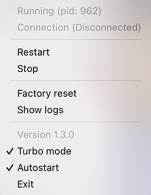
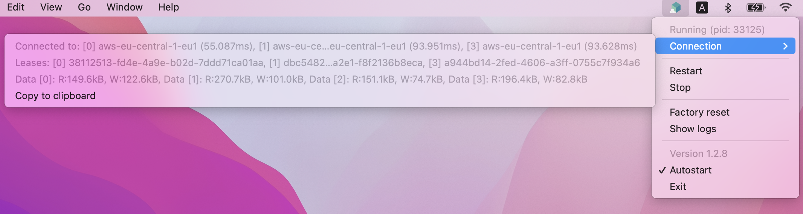

# Testcontainers Cloud Turbo Mode Sample
This repository contains tests to be run with [turbo mode](https://knowledge.testcontainers.cloud/turbo-mode)

### Start using Turbo Mode with Testcontainers Cloud
Since version Testcontainers Cloud v1.3.0 you can select the checkbox Turbo mode to enable the mode locally



### Clone the repository

```
git clone https://github.com/AtomicJar/testcontainers-cloud-turbo-mode-sample
cd testcontainers-cloud-turbo-mode-sample/
```

### Run the test suite for the first time

```
./gradlew test
```

ℹ️ You will see that the images are pulled for first time.


### Run the test suite multiple times to take advantage of cached docker images
```
./gradlew cleanTest test
```

ℹ️ Sequential executions during the same session will re-use the cached docker images. 

### How to verify that Turbo mode is enabled?
When you configured turbo mode for Testcontainers Cloud and your build tool, you should see multiple lease allocations in the connection tab of the Testcontainers Cloud application once you run your tests.

